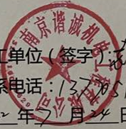

# 基于参考项目的公章端到端识别
推理部署或者体验尝试，可以参考我的项目 https://github.com/Gmgge/ImageAnalysisService <br>

如果有真实印章数据想要贡献的，或者说有印章数据需要构建标签的，我这边有自动化工具可以生成标签，欢迎共享

根据自测，由于真实数据缺失，对印章名（印章中水平的文字识别精度稍低，尤其倾斜或模糊的情况下），如果在体验有中任何识别错误想要提升的，欢迎反馈。
我会定期构建优化版本。

## 参考项目
[trocr项目](https://github.com/microsoft/unilm/tree/master/trocr) <br>
[trocr-chinese项目](https://github.com/chineseocr/trocr-chinese)

## 近期更新点
- [x] 推出[数据集分享页面](https://github.com/Gmgge/TrOCR-Seal-Recognition/blob/main/DataSet.md)，包括互联网其他开源链接引用、自制数据集
- [ ] 推出超轻量印章检测项目，包含印章检测数据集、推荐检测算法、模型训练、onnx推理部署
- [ ] 推出新的识别模型，见下方分享的百度云链接，请注意该模型需要将输入图像resize为(320,320)

## 功能规划
- [x]  发布标准公章端到端识别onnx模型
- [x]  增加置信度过滤
- [x]  轻量化
- [x]  基础印章数据集共享计划（仅含真实印章数据）
- [ ]  更多格式的圆形印章支持

1. 欢迎提供公章数据以提升模型，任何提供有效数据的都会被认为该项目贡献者，且可以定制化模型训练或者交流训练技巧
2. 如果数据不方便分析，欢迎反馈识别错误的样例与数据模板，我会尝试生成虚拟数据

## 环境编译
```
docker build --network=host -t trocr-chinese:latest .
docker run --gpus all -it -v /tmp/trocr-chinese:/trocr-chinese trocr-chinese:latest bash

```
## 训练
### 初始化模型到自定义训练数据集
#### 字符集准备参考cust-data/vocab.txt
```
vocab.txt
1
2
...
a
b
c
```
```[python]
python tool/gen_vocab.py \
       --dataset_path "dataset/cust-data/0/" \
       --cust_vocab ./cust-data/vocab.txt

```
### 初始化自定义数据集模型
#### 下载预训练模型trocr模型权重
链接: https://pan.baidu.com/s/1rARdfadQlQGKGHa3de82BA  密码: 0o65.  
google driver: https://drive.google.com/drive/folders/1ibOVCHu33asiMUaFT9FzvhFNM4z25cJY?usp=share_link  
```
python tool/init_custdata_model.py \   
    --cust_vocab ./cust-data/vocab.txt \  
    --pretrain_model ./weights \
    --cust_data_init_weights_path ./cust-data/weights
    
## cust_vocab 词库文件   
## pretrain_model 预训练模型权重   
## cust_data_init_weights_path 自定义模型初始化模型权重保存位置   

```

### 训练模型
#### 数据准备,数据结构如下图所示
```
dataset/cust-data/0/0.jpg
dataset/cust-data/0/0.txt
...
dataset/cust-data/100/10000.jpg
dataset/cust-data/100/10000.txt
```

#### 训练模型
```
python train.py \
       --cust_data_init_weights_path ./cust-data/weights \
       --checkpoint_path ./checkpoint/trocr-custdata \
       --dataset_path "./dataset/cust-data/" \
       --per_device_train_batch_size 8 \
       --CUDA_VISIBLE_DEVICES 1
```

#### 评估模型
##### 拷贝checkpoint/trocr-custdata训练完成的pytorch_model.bin 到 ./cust-data/weights 目录下

```[python]
python eval.py \
    --dataset_path "./data/cust-data/test/" \
    --cust_data_init_weights_path ./cust-data/weights    
```

## 测试模型
```
## 拷贝训练完成的pytorch_model.bin 到 ./cust-data/weights 目录下
index = 2300 ##选择最好的或者最后一个step模型
cp ./checkpoint/trocr-custdata/checkpoint-$index/pytorch_model.bin ./cust-data/weights
python app.py --cust_data_init_weights_path ./cust-data/weights --test_img test/test.jpg
```
## 转onnx 
```shell
python -m \
    transformers.onnx \
    hand-write \
    --feature=vision2seq-lm \
    hand-write-onnx --atol 1e-4

cp hand-write/vocab.json hand-write-onnx/

python onnx_test.py --model hand-write-onnx --test_img ./img/hand.png

```

## 预训练模型
| 模型        | cer(字符错误率)           | acc(文本行)  | 下载地址  |训练数据来源 |训练耗时(GPU:3090) | 
| ------------- |:-------------:| -----:|-----:|-----:|-----:|
| hand-write(中文手写)      |0.011 | 0.940 |[hand-write](https://pan.baidu.com/s/19f7iu9tLHkcT_zpi3UfqLQ)  密码: punl |[数据集地址](https://aistudio.baidu.com/aistudio/datasetdetail/102884/0) |8.5h(10epoch)|
| seal-ocr(印章识别)      |0.009 | 0.923 |[seal](https://pan.baidu.com/s/1f4rB7dWyRHtDUoiczNf_fQ?pwd=e7l8)|互联网络爬取，标签由付费api识别加人工验证|
| im2latex(数学公式识别)      |- | - |- |[im2latex](https://zenodo.org/record/56198#.YkniL25Bx_S) ||
| TAL_OCR_TABLE(表格识别)     |- | - |- |[TAL_OCR_TABLE](https://ai.100tal.com/dataset) |
| TAL_OCR_MATH(小学低年级算式数据集)|- | - |- | [TAL_OCR_MATH](https://ai.100tal.com/dataset) |
| TAL_OCR_CHN(手写中文数据集)|0.0455 | 0.674（标注质量不太高,例如：test_64/552.jpg 标注值:蝶恋花, 实际值:欧阳修  ） |[TAL_OCR_CHN](https://pan.baidu.com/s/1GbyVpbiKyVN1nJipvH2fpA)  密码: 9kd8 | [TAL_OCR_CHN](https://ai.100tal.com/dataset) |0.6h(20epoch)|
| HME100K(手写公式)|- | - |- | [HME100K](https://ai.100tal.com/dataset) |

### 模型调用 
#### 公章识别

```
下载onnx推理模型，放入当前目录
python onnx_test.py --model {模型目录} --test_img ./img/seal_0.png

## output: '[1.0, 1.0, 1.0, 0.94803417, 0.99987036, 0.9999962, 0.99990654, 1.0, 0.9999809, 0.99999815, 1.0, 1.0, 1.0]
0.99598354
南京谐诚机电工程有限公司
'
```

## 经验
1) 如果收集的公章数据不足，需要生成虚拟公章并生成随机文字，保证对常用文字的识别能力
2) 印章名（水平文字部分），存在多行情况，由于真实数据集的缺少，目前测试精度较低


