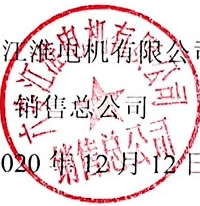

# 基于参考项目的公章端到端识别

**非常感谢[Jonsun-N](https://github.com/Jonsun-N) 共享印章真实数据2w左右，经过授权同意，我将在构建标签后开源该数据集，并据此重新训练模型**
**由于大家对数据集的强烈需求，已经在数据标签页面更新5000印章数据，印章识别标签尚未构建，有想要贡献标签的可以联系！**

**我会定期构建优化版本, 接受的反馈越多模型迭代越快，除去最优模型都会开源！**

**推理部署或者体验尝试，可以参考我的项目 https://github.com/Gmgge/ImageAnalysisService**

1. **由于真实数据缺失，如果在体验有中任何识别错误想要提升的，欢迎反馈！**
2. **有真实印章数据想要贡献的，我这边有自动化工具可以生成标签，欢迎共享！**
3. **任何提供有效数据的都会被认为该项目贡献者，可以定制化模型训练或者交流训练技巧**

## 1. 参考项目
[trocr项目](https://github.com/microsoft/unilm/tree/master/trocr) <br>
[trocr-chinese项目](https://github.com/chineseocr/trocr-chinese)

## 2. 近期更新点
- [x] 推出[数据集分享页面](https://github.com/Gmgge/TrOCR-Seal-Recognition/blob/main/DataSet.md)，增加印章检测数据集
- [ ] 推出超轻量印章检测项目，包含印章检测数据集、推荐检测算法、模型训练、onnx推理部署
- [ ] 推出新的识别模型，见下方分享的百度云链接，请注意该模型需要将输入图像resize为(320,320)

## 3. 功能规划
- [x]  发布标准公章端到端识别onnx模型
- [x]  增加置信度过滤
- [x]  轻量化
- [x]  基础印章数据集共享计划（仅含真实印章数据）
- [ ]  更多格式的圆形印章支持

## 4. 训练

### 4.1 环境安装
```
pip install -r requirements.txt
pip install torch==1.13.1+cu116 torchvision==0.14.1+cu116 torchaudio==0.13.1 --extra-index-url https://download.pytorch.org/whl/cu116
```

### 4.2 印章识别数据集构建
数据集文件夹 seal_dataset,其文件夹下存储图像与标签，存储形式为：
```
0.jpg  # 图像
0.txt  # 标签
...
100000.jpg
100000.txt
```
#### 4.2.1 签格式


该图像标签为：六安江淮电机有限公司#销售总公司 <br>
备注：如果不需要水平文字，可以去除相应标签，本例中去除后的标签为：六安江淮电机有限公司


### 4.3 根据自定义训练数据集初生成字典

#### 4.3.1 字典生成
```[python]
python tool/gen_vocab.py \
       --dataset_path "seal_dataset/" \
       --cust_vocab ./cust-data/vocab.txt

```
生成例如该形式的vocab.txt
```
vocab.txt
1
2
...
a
b
c
```


### 4.4 初始化模型参数
#### 下载预训练模型trocr模型权重
下载weights并解压到当前目录
链接: https://pan.baidu.com/s/1rARdfadQlQGKGHa3de82BA  密码: 0o65.  
google driver: https://drive.google.com/drive/folders/1ibOVCHu33asiMUaFT9FzvhFNM4z25cJY?usp=share_link  
```
# 根据字典生成模型配置
python tool/init_custdata_model.py \   
    --cust_vocab ./cust-data/vocab.txt \  
    --pretrain_model ./weights \
    --cust_data_init_weights_path ./cust-data/weights
    
# 将生成vocab.json 替换到./weights中
cp ./cust-data/weights/vocab.json ./weights

# 再次生成，获得正确的tokenizer.json
python tool/init_custdata_model.py \   
    --cust_vocab ./cust-data/vocab.txt \  
    --pretrain_model ./weights \
    --cust_data_init_weights_path ./cust-data/weights
    
## cust_vocab 字典文件   
## pretrain_model 预训练模型权重   
## cust_data_init_weights_path 自定义模型初始化模型权重保存位置   

```

### 4.5 训练模型

```
python train.py \
       --cust_data_init_weights_path ./cust-data/weights \
       --checkpoint_path ./checkpoint/trocr-custdata \
       --dataset_path ".seal_dataset/" \
       --per_device_train_batch_size 8 \
       --CUDA_VISIBLE_DEVICES 0
```

#### 4.6 评估模型

拷贝checkpoint/trocr-custdata训练完成的pytorch_model.bin 到 ./cust-data/weights 目录下
```[python]
python eval.py \
    --dataset_path "./data/cust-data/test/" \
    --cust_data_init_weights_path ./cust-data/weights    
```

## 5 测试模型
```
## 拷贝训练完成的pytorch_model.bin 到 ./cust-data/weights 目录下
index = 2300 ##选择最好的或者最后一个step模型
cp ./checkpoint/trocr-custdata/checkpoint-$index/pytorch_model.bin ./cust-data/weights
python ./tool/app.py --cust_data_init_weights_path ./cust-data/weights --test_img test/test.jpg
```

## 6 转onnx 
```shell
python -m \
    transformers.onnx \
    --model={model_path} \
    --feature=vision2seq-lm \
    {save_path} --atol 1e-4

cp ./cust-data/weights/vocab.json save_path/

python onnx_test.py --model save_path --test_img ./img/seal_0.png

```

# 附录

## 预训练模型
| 模型        | cer(字符错误率)           | acc(文本行)  | 下载地址  |训练数据来源 |训练耗时(GPU:3090) | 
| ------------- |:-------------:| -----:|-----:|-----:|-----:|
| hand-write(中文手写)      |0.011 | 0.940 |[hand-write](https://pan.baidu.com/s/19f7iu9tLHkcT_zpi3UfqLQ)  密码: punl |[数据集地址](https://aistudio.baidu.com/aistudio/datasetdetail/102884/0) |8.5h(10epoch)|
| seal-ocr(印章识别)      |0.009 | 0.923 |[seal](https://pan.baidu.com/s/1yl9bsae7w-lqS4t6Mzh_Qg?pwd=cV1I)|互联网络爬取，标签由付费api识别加人工验证|
| im2latex(数学公式识别)      |- | - |- |[im2latex](https://zenodo.org/record/56198#.YkniL25Bx_S) ||
| TAL_OCR_TABLE(表格识别)     |- | - |- |[TAL_OCR_TABLE](https://ai.100tal.com/dataset) |
| TAL_OCR_MATH(小学低年级算式数据集)|- | - |- | [TAL_OCR_MATH](https://ai.100tal.com/dataset) |
| TAL_OCR_CHN(手写中文数据集)|0.0455 | 0.674（标注质量不太高,例如：test_64/552.jpg 标注值:蝶恋花, 实际值:欧阳修  ） |[TAL_OCR_CHN](https://pan.baidu.com/s/1GbyVpbiKyVN1nJipvH2fpA)  密码: 9kd8 | [TAL_OCR_CHN](https://ai.100tal.com/dataset) |0.6h(20epoch)|
| HME100K(手写公式)|- | - |- | [HME100K](https://ai.100tal.com/dataset) |


## 公章识别

```
下载onnx推理模型，放入当前目录
python onnx_test.py --model {模型目录} --test_img ./img/seal_0.png

## output: '[1.0, 1.0, 1.0, 0.94803417, 0.99987036, 0.9999962, 0.99990654, 1.0, 0.9999809, 0.99999815, 1.0, 1.0, 1.0]
0.99598354
南京谐诚机电工程有限公司
'
```

## 经验
1) 如果收集的公章数据不足，需要生成虚拟公章并生成随机文字，保证对常用文字的识别能力
2) 印章名（水平文字部分），存在多行情况，由于真实数据集的缺少，目前测试精度较低


